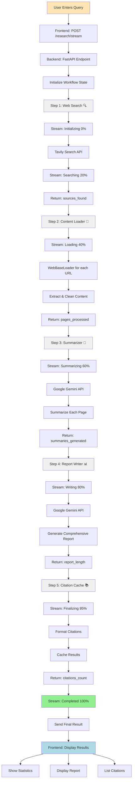
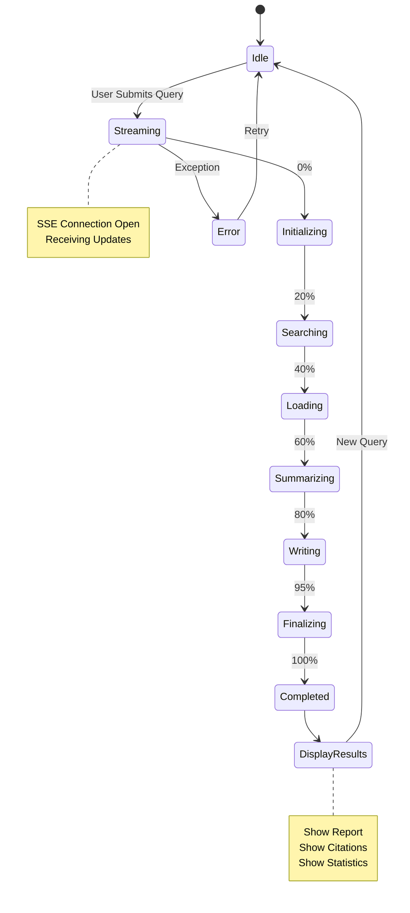
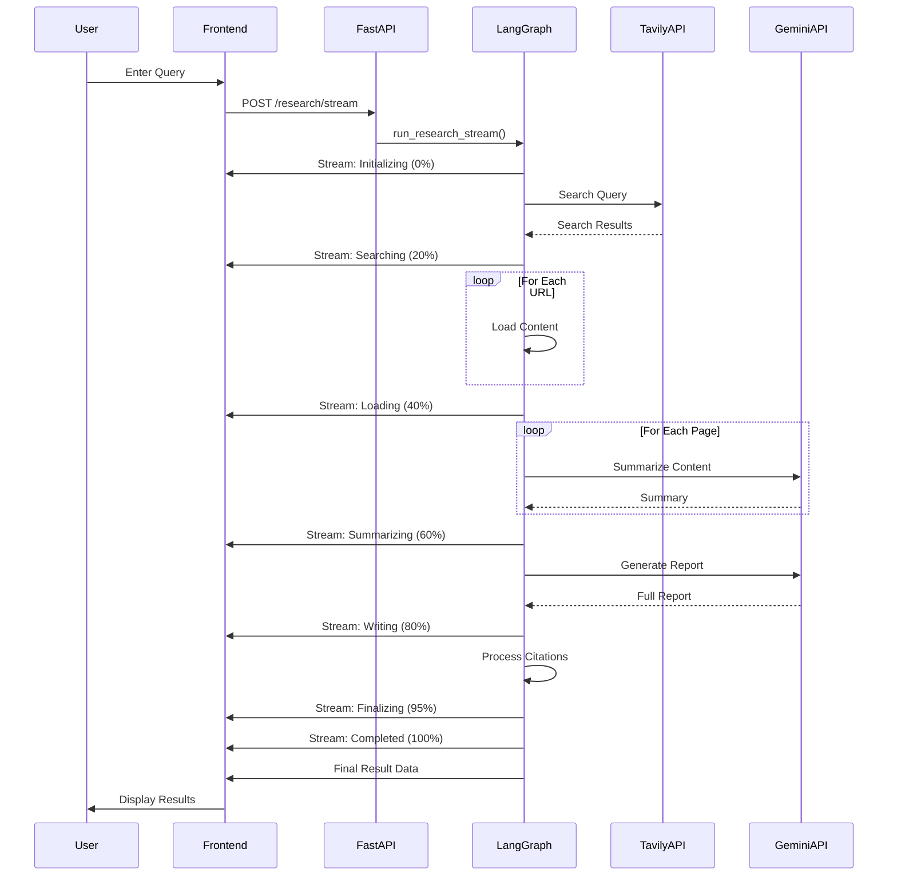
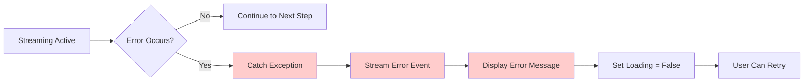

# Web Research Assistant - Workflow Diagram

## Complete Streaming Workflow



## Frontend State Flow



## Data Flow Architecture



## Component Architecture

```
┌─────────────────────────────────────────────────────────────┐
│                         Frontend (Next.js)                   │
├─────────────────────────────────────────────────────────────┤
│                                                               │
│  ┌──────────────┐  ┌──────────────┐  ┌──────────────┐      │
│  │  Search Form │  │  Progress Bar│  │ Workflow Steps│      │
│  │              │  │   0-100%     │  │   Timeline    │      │
│  └──────────────┘  └──────────────┘  └──────────────┘      │
│                                                               │
│  ┌──────────────┐  ┌──────────────┐  ┌──────────────┐      │
│  │   Results    │  │    Report    │  │   Citations   │      │
│  │  Statistics  │  │   Display    │  │     List      │      │
│  └──────────────┘  └──────────────┘  └──────────────┘      │
│                                                               │
│                    SSE Handler (EventSource)                 │
└─────────────────────────────────────────────────────────────┘
                              ↕
                    HTTP/SSE Connection
                              ↕
┌─────────────────────────────────────────────────────────────┐
│                      Backend (FastAPI)                       │
├─────────────────────────────────────────────────────────────┤
│                                                               │
│  ┌──────────────────────────────────────────────────────┐  │
│  │              Streaming Endpoint                       │  │
│  │         POST /research/stream                         │  │
│  │                                                        │  │
│  │  • Receives query                                     │  │
│  │  • Calls run_research_stream()                        │  │
│  │  • Yields SSE events                                  │  │
│  └──────────────────────────────────────────────────────┘  │
│                              ↕                                │
│  ┌──────────────────────────────────────────────────────┐  │
│  │              LangGraph Workflow                       │  │
│  │                                                        │  │
│  │  ┌────────────┐  ┌────────────┐  ┌────────────┐     │  │
│  │  │ Web Search │→ │  Content   │→ │ Summarizer │     │  │
│  │  │   Agent    │  │   Loader   │  │            │     │  │
│  │  └────────────┘  └────────────┘  └────────────┘     │  │
│  │         ↓                ↓                ↓           │  │
│  │  ┌────────────┐  ┌────────────┐                      │  │
│  │  │   Report   │→ │ Citation   │                      │  │
│  │  │   Writer   │  │   Cache    │                      │  │
│  │  └────────────┘  └────────────┘                      │  │
│  │                                                        │  │
│  │  Each node yields progress updates                    │  │
│  └──────────────────────────────────────────────────────┘  │
│                              ↕                                │
│  ┌──────────────────────────────────────────────────────┐  │
│  │              External APIs                            │  │
│  │                                                        │  │
│  │  • Tavily Search API (Web Search)                     │  │
│  │  • Google Gemini API (Summarization & Report)         │  │
│  │  • WebBaseLoader (Content Extraction)                 │  │
│  └──────────────────────────────────────────────────────┘  │
└─────────────────────────────────────────────────────────────┘
```

## Workflow Step Details

### Step 1: Web Search (20%)
```
Input:  User query
Action: Search web using Tavily API
Output: List of URLs with titles and snippets
Stream: {"step": "searching", "progress": 20, "data": {"sources_found": 10}}
```

### Step 2: Content Loader (40%)
```
Input:  List of URLs
Action: Extract full content from each URL
Output: Cleaned page content
Stream: {"step": "loading", "progress": 40, "data": {"pages_processed": 10}}
```

### Step 3: Summarizer (60%)
```
Input:  Page contents
Action: AI summarization of each page
Output: Individual summaries
Stream: {"step": "summarizing", "progress": 60, "data": {"summaries_generated": 10}}
```

### Step 4: Report Writer (80%)
```
Input:  All summaries
Action: Generate comprehensive report
Output: Full research report
Stream: {"step": "writing", "progress": 80, "data": {"report_length": 5000}}
```

### Step 5: Citation Cache (95%)
```
Input:  Summaries and report
Action: Format citations and cache
Output: Structured citations
Stream: {"step": "finalizing", "progress": 95, "data": {"citations_count": 10}}
```

### Step 6: Completed (100%)
```
Input:  All workflow results
Action: Format final response
Output: Complete research package
Stream: {"step": "completed", "progress": 100}
        {"type": "result", "data": {...}}
```

## UI State Transitions

```
┌──────────────┐
│  Empty State │  ← Initial load
└──────┬───────┘
       │ User enters query
       ↓
┌──────────────┐
│   Loading    │  ← Show progress bar & workflow steps
│   State      │
└──────┬───────┘
       │ Research completes
       ↓
┌──────────────┐
│   Results    │  ← Display report, citations, stats
│   State      │
└──────┬───────┘
       │ New query
       ↓
┌──────────────┐
│   Loading    │  ← Reset and start again
│   State      │
└──────────────┘
```

## Error Handling Flow



## Performance Metrics

| Stage | Typical Duration | API Calls | Network |
|-------|-----------------|-----------|---------|
| Initializing | < 1s | 0 | Minimal |
| Searching | 2-5s | 1 (Tavily) | Medium |
| Loading | 5-15s | 10 (HTTP) | High |
| Summarizing | 20-40s | 10 (Gemini) | High |
| Writing | 10-20s | 1 (Gemini) | Medium |
| Finalizing | < 1s | 0 | Minimal |
| **Total** | **40-80s** | **22** | **High** |

## Key Technologies

- **Backend:** FastAPI, LangGraph, LangChain
- **Frontend:** Next.js 15, React 19, TypeScript
- **Streaming:** Server-Sent Events (SSE)
- **APIs:** Tavily Search, Google Gemini
- **Styling:** Tailwind CSS 4
- **State:** React useState hooks

## Benefits of Streaming Architecture

1. **Real-Time Feedback** - Users see progress immediately
2. **Better UX** - No black-box waiting
3. **Transparency** - Clear visibility into AI operations
4. **Debugging** - Easy to identify bottlenecks
5. **Engagement** - Users stay engaged during long operations
6. **Trust** - Builds confidence by showing the process
7. **Cancellation** - Potential to cancel mid-stream (future)

## Conclusion

The streaming architecture transforms the research experience from a synchronous, blocking operation into an engaging, transparent process. Users can watch as the AI searches, analyzes, and synthesizes information in real-time, creating a more interactive and trustworthy experience.
